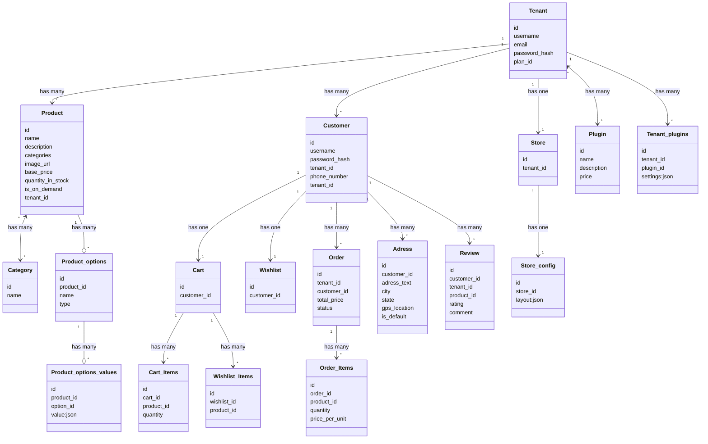

```mermaid
---

config:

  class:

    hideEmptyMembersBox: true

---

classDiagram

direction TB

    class Tenant {

        id

        username

        email

        password_hash

        plan_id

    }

    class Store {

        id

        tenant_id

    }

    class Product {

        id

        name

        description

        categories

        image_url

        base_price

        quantity_in_stock

        is_on_demand

        tenant_id

    }

    class Category {

        id

        name

    }

    class Product_options {

        id

        product_id

        name

        type

    }

    class Product_options_values {

        id

        product_id

        option_id

        value:json

    }

    class Customer {

        id

        username

        password_hash

        tenant_id

        phone_number

        tenant_id

    }

    class Cart {

        id

        customer_id

    }

    class Cart_Items {

        id

        cart_id

        product_id

        quantity

    }

    class Wishlist {

        id

        customer_id

    }

    class Wishlist_Items {

        id

        wishlist_id

        product_id

    }

    class Order {

        id

        tenant_id

        customer_id

        total_price

        status

    }

    class Order_Items {

        id

        order_id

        product_id

        quantity

        price_per_unit

    }

  

    class Plugin{

        id

        name

        description

        price

    }

  

    class Tenant_plugins{

        id

        tenant_id

        plugin_id

        settings:json

    }

  

    class Adress{

        id

        customer_id

        adress_text

        city

        state

        gps_location

        is_default

    }

  

    class Review{

        id

        customer_id

        tenant_id

        product_id

        rating

        comment

    }

  

    class Store_config{

        id

        store_id

        layout:json

    }

  

    Product_options "1" --o "*" Product_options_values : has many

    Product "1" --o "*" Product_options : has many

    Product "*" <--> "*" Category : has many

    Tenant "1" --> "1" Store : has one

    Tenant "1" --> "*" Product : has many

    Tenant "1" --> "*" Customer : has many

    Customer "1" --> "1" Cart : has one

    Cart "1" --> "*" Cart_Items : has many

    Customer "1" --> "1" Wishlist : has one

    Cart "1" --> "*" Wishlist_Items : has many

    Customer "1" --> "*" Order : has many

    Order "1" --> "*" Order_Items : has many

    Tenant "*" <--> "*" Plugin : has many

    Tenant "1" --> "*" Tenant_plugins: has many

    Customer "1" --> "*" Adress : has many

    Customer "1" --> "*" Review : has many

    Store "1" --> "1" Store_config: has one
```

[[multi-tenant saas e-commerce platform]]
