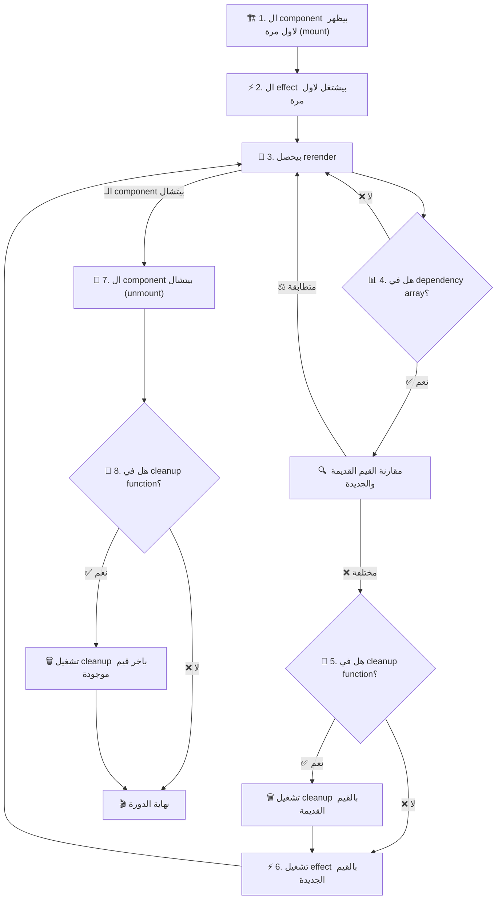
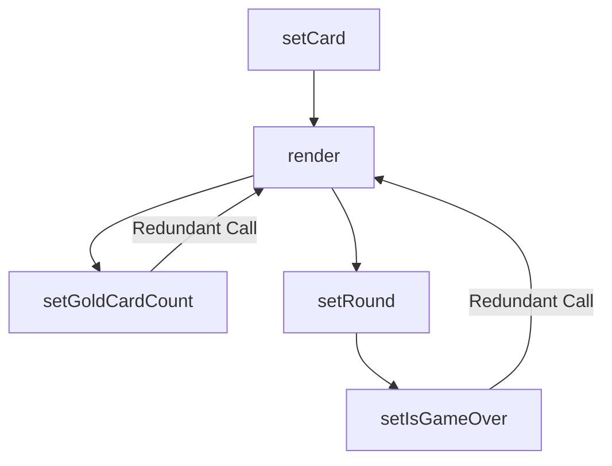

ف المقال ده هنتكلم عن ال use effect hook من جميع الجوانب هنفهم وظيفته في react

لو سألت ١٠ اشخاص مختلفين ايه وظيفة ال use effect hook هيجيلك ١٠ اجابات مختلفة ..

الي هيقولك انه بيعمل حاجة لما ال UI يحصله render.

الي هيقولك انه مستخدم عشان تجيب داتا من API.

الي هيقولك انه موجود عشان يراقب قيم معينة ولما تتغير يعمل حاجة.

احنا ممكن نجمع الردود دي كلها في اجابة واحدة من جزئين:

اولا: ال use effect hook هو escape hatch زيه زي use ref بيسمحلنا نتواصل مع حجات برا react جوه ال components بتاعتنا.  

حجات زي: -

- ال DOM APIs زي add event listener و ال intersection observer.
- ال APIs الخارجية و اني اجيب منها data باستخدام ال fetch API.
- اي element خارجي مش معمول عشان react زي custom video player او map component او jQuery plugins مثلا.

ثانيا: هو كمان بيسمحلنا اننا نعمل synchronization ما بين ال component بتاعنا و السيستم الخارجي ده. بمعنى ان ال لما ال system الخارجي يتغير ال UI يتغير معاه و العكس صحيح.  

طب الكلام ده كله بيحصل ازاي ؟ ال use effect hook بيتكون من ايه ؟ طب اقدر استخدمه ازاي ؟ كل دي اسئلة هنجاوب عليها في المقال ده.

## مكونات ال useEffect

هو بشكل عام بيتكون من ٣ اجزاء  

- ال Effect.
- ال Clean up.
- ال Dependencies.

``` ts info:9-10,13-15,17
import {useState, useEffect} from "react"

export default function App({ roomId }){

	const [serverUrl, setServerUrl] = useState("https://localhost:5173")

	// effect
	useEffect(()=>{
		const connection = createConnection(serverUrl, roomId)
		connection.connect()

		// clean up
		return ()=>{
			connection.disconnect()
		}
		
	}, [roomId, serverUrl]) // dependencies

}
```

تعالى كده نفصل ف شرحهم على اكتر من مثال: -  

ال effect ده الحاجة الي انت عاوز تعملها و بيتنفذ اول لما ال component يظهر اول مرة او لو ال dependencies اتغيرت بعد اي rerender و ده غالبا بيبقى له تأثير على حاجة او بيستخدم حاجة من برا ال component و ليكن مثلا انك تعمل event listener او تعمل fetch لشوية data او تعمل set timeout.  

ال clean up دي بتبقى حاجة عكس ال effect بالظبط و بتشتغل لما ال component يتشال من ال component tree او لو ال dependencies اتغيرت بعد اي rerender بس قبل ما يتم تنفيذ ال effect الجديد و دي موجودة عشان لما ال component يتشال ميسبش وراه اثر بحيث ال effects متدخلش ف بعض ما بين ال rerenders ف لازم ايا كان ال effect يبقى في حاجة بتعكسه او بتلغيه و لو كان حاجة ملهاش تأثير باقي يبقى مش محتاج تعمل clean up (مع العلم انه لو حاجة ملهاش تأثير ف هي غالبا مش effect و مش محتاج تحطها ف use effect)

لو كان fetch ممكن تستعمل abort controller

``` ts
useEffect(()=>{
	const abortController = new AbortController();
	async function fetchData(){
		const response = await fetch(url, {
			signal: abortController.signal,
		})
	}
	
	fetchData()
	
	return ()=>{
		abortController.abort()
	}
}, []) 
```

لو كان set timeout او interval ممكن تستعمل clear timeout او clear interval

``` ts
useEffect(()=>{
	const timer = setTimeout(()=>{
		console.log('1 second later')
	}, 1000)

	return ()=>{
		clearTimeout(timer)
	}
}, []) 
```

لو كان add event listener ممكن تستعمل remove event listener  

``` ts
useEffect(()=>{
	function handleMove(e){
		console.log(`mouse at ${e.clientX}, ${e.clientY}`)
	}
	window.addEventListener("pointermove", handleMove)

	return ()=>{
		window.removeEventListener("pointermove", handleMove)
	}
}, []) 
```  

و كمان على حسب ال effect تقدر تعمل ال cleanup المناسب.

ولو انت جاي من ايام ما كانت react بتستخدم ال class component ف ال effect ممكن يعتبر بديل لل componentDidMount و componentDidUpdate و ال cleanup بديل لل componentWillUnmount.

## ال dependency array

ال dependency array ده بيبقى array من القيم الي ال effect بيعتمد عليها بحيث ان لو حاجة منهم اتغيرت انا بحتاج اعمل re-run لل effect عشان يبقى in sync مع ال data الي اتغيرت دي.

كل rerender بنقارن القيم الي موجودة ف ال dependency array بالقيم الي كانت موجودة ف ال render الي فات و لو لقينا واحد فيهم عالاقل مختلف هيشغل ال cleanup بتاع ال effect الي فات و بعدها يشغل ال effect تاني بالقيم الجديدة.

و عشان نبسط الموضوع اكتر ده ترتيب تشغيل اجزاء ال useEffect hook:



ايه القيم الي ممكن تكون ف ال dependency array ؟ اي قيمة reactive يعني ممكن تتغير ما بين ال rerenders زي ال props او ال state مثلا و كمان اي variable بياخد قيمته من props او state و اي function مكتوبة جوه ال component سواء بتستخدم قيم من ال state او ال props او لا (بس دي فيها اعتبارات هنتكلم فيها كمان شوية) ولو انت بتستخدم linter زي eslint مثلا هتلاقيه بيقولك لو ال dependency array ناقصه حاجة.

``` ts info:4,7,16
import {useState, useEffect} from "react"

// props are reactive
export default function App({ roomId }){

	// state is reactive
	const [serverUrl, setServerUrl] = useState("https://localhost:5173")
	
	useEffect(()=>{
		const connection = createConnection(serverUrl, roomId)
		connection.connect()
		return ()=>{
			connection.disconnect()
		}
		
	}, [roomId, serverUrl]) // dependencies
}
```

```ts info:8,12
import {useState, useEffect} from "react"

export default function App(){
	const [firstName, setFirstName] = useState("eyad")
	const [lastName, setLastName] = useState("alsherif")

	// name is reactive because it is derived from state 
	const name = firstName + " " lastName
	
	useEffect(()=>{
		console.log(name)
	}, [name]) // dependencies
}
```

و ال dependency array ممكن يبقى فاضي و ده معناه ان ال effect بتاعك مش معتمد على قيم خارجية يبقى كده ال effect هيحصل مرة واحدة بس اول لما ال component يحصله mount و ال cleanup هيحصل مرة واحدة بس لما ال component يحصله unmount.

```ts info:16
import {useState, useEffect} from "react"

export default function App({ url }){
	const [data, setData] = useState(null)

	// effect only runs once
	useEffect(()=>{
	
		async function fetchData(){
			const response = await fetch(url)
			const jsonData = await response.json()
			setData(jsonData);
		}
		
		fetchData()
	}, []) // empty dependency array
}
```

و ال dependency array ده optional اصلا يعني ممكن تشيله و متحطهوش من اساسه و ده معناه انك عاوز ال use effect hook بتاعك يشتغل بعد كل rerender و ده استخدامه قليل عشان ممكن يأثر عال performance بتاع الويبسايت

```ts info:11
import {useReducer, useEffect, useRef} from "react"

export default function App({ url }){
	const rerenderCount = useRef(0)
	// this forces the component to rerender
	const rerender = useReducer(x => x+1, 0)[1]

	// effect runs on every rerender
	useEffect(()=>{
		rerenderCount.current += 1;
	}) // no dependency array

	return <button onClick={rerender}>rerendered {rerenderCount.current} times </button>
}
```

 اهم معلومة لازم تعرفها هنا ان ال use effect hook لما يجي يقارن ال dependencies القديمة بالجديدة بيستخدم [Object.is](http://object.is/) يعني لازم القيمة تكون نفسها و ال reference كمان يكون نفسه و لو لقى واحدة فيهم عالاقل مختلفة بيشغل ال cleanup القديمة و يشغل ال effect تاني.

 ده مش مهم لو كانت ال dependencies بتاعتنا primitives زي ال strings او ال numbers بس هتعمل معانا مشاكل لو كانت reference types زي ال functions و ال objects و ال arrays عشان لما تيجي تكتب function او object جوه ال component هتلاقيه بيحصله creation بعد كل rerender و بالتالي ال reference بتاعه هيتغير و بالنسبة لل use effect هيبقى قيمة مختلفة عن الي فاتت و ال effect بتاعك هيشتغل مع ان مفيش حاجة اتغيرت.

```ts info:7,17-19
import {useEffect} from "react"

export default function App({name, age}){

	// this object is recreated on every rerender
	// and its reference is not stable
	const user = {userName: name, userAge:age}

	// effect runs on every rerender
	// even if user doesn't change
	useEffect(()=>{
		console.log(user)
	}, [user]) 

	// this function is recreated on every rerender
	// and its reference is not stable
	function logData(){
		console.log(`user name is ${name} and age is ${age}`)
	}

	// effect runs on every rerender
	useEffect(()=>{
		logData()
	}, [logData]) 
	
}
```

لكن لا تقلق فالحل بسيط، الحل انك متعتمدش على حاجة ال reference بتاعها بيتغير بعد كل rerender او انك تحاول تخلي ال reference بتاعها يتغير لما هي تتغير فعلا او لو هي قيمه ثابته يبقى تثبت ال reference انه ميتغيرش. طب تعمل حاجة زي دي ازاي ؟  

### حلول مشاكل الاعتماد على ال reference types في ال dependency array

1. لو بتعتمد على حاجة ثابته يبقى اكتبها برا ال component بتاعك كده ال reference بتاعها هيفضل ثابت على طول

```ts hl:5,12
import {useEffect} from "react"

// this objects doesn't change.
// and its reference is stable
const user = {name:"eyad", age:23}

export default function App(){

	// user is not a dependency 
	useEffect(()=>{
		console.log(user)
	}, []) 
	
}
```

```ts hl:5-7,14
import {useEffect} from "react"

// this function doesn't change.
// and its reference is stable
function logData(name, age){
	console.log(`user name is ${name} and age is ${age}`)
}

export default function App({name, age}){

	// logData is not a dependency 
	useEffect(()=>{
		logData(name, age)
	}, [name, age]) 
	
}
```

لو بتعتمد على حاجة بتحتاج قيم من ال component عندك اكتر من حل: -

2. ممكن تكتبها جوا ال useEffect كده هو مش هيعتبرها dependency اصلا بس كده مش هتقدر تشوفها برا ال effect.

```ts hl:7,10
import {useEffect} from "react"

export default function App({name, age}){

	useEffect(()=>{
		// user is not a dependency 
		const user = {userName: name, userAge:age}
		console.log(user) // {userName: "eyad", userAge: 23}
	
	}, [name, age]) 

	console.log(user) // undefined
}
```

```ts hl:8-10,14
import {useEffect, useState} from "react"

export default function App({name}){
	const [user, setUser] = useState()

	useEffect(()=>{
		// logData is not a dependency
		function logData(name, age){
			console.log(`user name is ${name} and age is ${age}`)
		}

		logData(name, age) // user name is eyad and age is 23
	
	}, [name, age]) 

	logData(name, age) // the function is not defined here
}
```

3. لو محتاج تشوفها برا ال effect عندك حل تاني انك تحطها جوا state او useMemo لو هي object او array او تحطها جوا useCallback لو هي function بحيث ان ال reference بتاعهم يبقى ثابت معظم الوقت و يتغير بس لو الحاجة فعلا محتاجة تتغير.  

```ts hl:5,7,15
import {useEffect, useState, useMemo} from "react"

export default function App({name, age}){

	const [user, setUser] = useState({userName: name, userAge:age})
	// OR
	const user = useMemo(()=> ({userName: name, userAge:age}), [name, age])
	
	// user is a dependency
	// but it only changes when we call the setUser function
	// OR it only changes when its dependencies change (useMemo)
	// it will not run on every rerender
	useEffect(()=>{
		console.log(user) // {userName: "eyad", userAge: 23}
	}, [user]) 

	console.log(user) // {userName: "eyad", userAge: 23}
}
```

```ts hl:5-7,14
import {useEffect, useCallback} from "react"

export default function App({name, age}){

	const logData = useCallback(()=> {
		console.log(`user name is ${name} and age is ${age}`)
	}, [name, age])
	
	// logData is a dependency
	// but it only changes when its dependencies change
	// it will not run on every rerender
	useEffect(()=>{
		logData() // user name is eyad and age is 23
	}, [logData]) 

	logData() // user name is eyad and age is 23
}
```

بس بعد كل ده ممكن برضو تلاقي ال effect بتاعك بيشتغل مع انك عامل كل الخطوات الي فوق دي طب ايه السبب ؟  

### مشكلة الاعتماد على dependencies من خارج ال component

المشكلة دي بتحصل ف حالة ان ال component بيستقبل props نوعها object او function او array و ال props دي مكتوبة بشكل يخليها تتغير بعد كل rerender زي مثلا انها تبقى مكتوبة inline على ال component نفسه.

و من اكتر الامثلة شيوعا على حاجة زي كده لما بكون عامل button component مثلا و بديله onClick handler

معظمنا بيكتب ال onClick بشكل inline و ده ف معظم الحالات بيكون عادي الا لو في effect معتمد عليها ساعتها هتخلي ال effect ده يشتغل اكتر من مرة.

```tsx info:10,13-16,25,39
import {useEffect, useState} from "react"

export default function Parent({name, age}){
	const [count, setCount] = useState(0)

	return (
		<div>
			<Child1 
				count={count} 
				increment={() => setCount(c => c+1)}
			/>
			<Child2
				myObj={{
					userName: 'eyad',
					userAge: 23
				}}
			/>
		</div>
	)
}

function Child1({count, increment}){
	useEffect(()=>{
		console.log('I ❤ the increment function')
	}, [increment])

	return (
		<>
			<p>{count}</p>
			<button onClick={increment}>increment</button>
	    </>

	)
}

function Child2({myObj}){
	useEffect(()=>{
		console.log('I ❤ the user object')
	}, [myObj])

	return <p>my name is {myObj.userName} and I am {myObj.userAge} years old</p>
}

```

ف الحالة دي بيحصل اكتر من حاجة  

- لما ال parent يحصله rerender ال inline props او اي variable جواه بتتعمل من اول و جديد و ف حالة لو كانت object او function ال reference بتاعها بيتغير و ده بيخلي ال child component يحصله rerender حتى لو قيم ال props بتاعته متغيرتش.  
- كل مرة ال component يعمل rerender ال props بتاعته بتتغير و ده بيخلي ال effects المعتمدة على ال props تشتغل تاني مع ان قيمها متغيرتش برضو.

طب ازاي نحل المشكلة دي ؟  
نفس الحل الي اتكلمنا عنه فوق هنعمله هنا ف ال parent component، هنشوف ايه ال props الي بتكون arrays او objects او functions و نحطها ف use memo او use callback او نطلعها برا ال parent component عشان متتأثرش بال rerenders الا في حالة ان قيمتها اتغيرت فعلا.

```tsx rm:13,17-20 hl:5,7,14,21
import {useEffect, useState, useCallback, useMemo} from "react"

export default function Parent({name, age}){
	const [count, setCount] = useState(0)
	const increment = useCallback(() => setCount(c => c+1), [count])

	const memoisedObj = useMemo(() => ({userName:name, userAge:age}), [name, age])

	return (
		<div>
			<Child1 
				count={count} 
				increment={() => setCount(c => c+1)}
				increment={increment}
			/>
			<Child2
 				myObj={{
					userName: 'eyad',
					userAge: 23
				}}
				myObj={memoisedObj}
			/>
		</div>
	)
}

function Child1({count, increment}){
	useEffect(()=>{
		console.log('I ❤ the increment function')
	}, [increment])

	return (
		<>
			<p>{count}</p>
			<button onClick={increment}>increment</button>
	    </>

	)
}

function Child2({myObj}){
	useEffect(()=>{
		console.log('I ❤ the user object')
	}, [myObj])

	return <p>my name is {myObj.userName} and I am {myObj.userAge} years old</p>
}

```

## انت مش محتاج useEffect

بعد ما فهمنا ايه هي ال useEffect و عرفنا انها طريقة اني اعمل حاجة (effect) اول لما ال component بتاعي يظهر ف الصفحة (mount) او يتشال منها (unmount) او يحصله تحديث (rerender) ، و كمان هو طريقة اني اعمل side effects بدون ما يكون في event بيشغلها زي ضغطة ماوس او كيبورد مثلا، ف احنا دلوقتي نقدر نقول ان ال useEffect هي زي مخرج طوارئ من نظام React. بتسمحلك "تخرج برا" React و تعمل حاجة بعيدا عن تحكم react زي تعامل مع ال network ، ال DOM، او المتصفح و في حالة ان مفيش نظام خارجي انت ف الغالب مش محتاج تستخدم useEffect و تقدر تحل مشكلتك بطريقة ابسط زي ما هنشوف ف الامثلة الي معانا.  

### ١. تغيير الـ State بناءً على State تانية أو Props:

ممكن تكون بتستخدم useEffect عشان تغير ف الـ state بناءً على state تانية أو props. في الحالة دي، ممكن تعمل التغيير بتاعك مباشرة من غير useEffect او من غير state جديدة.  

حاجة زي انك تجمع اكتر من state ف variable واحد او انك تحسب داتا من state موجودة عندك كل ده تقدر تعمله مباشرة من غير useEffect او state جديدة.

```tsx rm:9-12 hl:16
import {useEffect, useState} from "react"

function Form() {

	const [firstName, setFirstName] = useState('eyad');
	const [lastName, setLastName] = useState('alsherif');

	// Bad: redundent state and effect
	const [fullName, setFullName] = useState('')
	useEffect(() => {
		setFullName(firstName + ' ' + lastName);
	}, [firstName, lastName])


	// Good: calculated during render
	const fullName = firstName + ' ' + lastName
}
```

```tsx rm:6-9 hl:12
import {useEffect, useState} from "react"

function Parent({data}) {

	// Bad: redundent state and effect
	const [filteredData, setFilteredData] = useState([]);
	useEffect(() => {
		setFilteredData(data.filter(item => item.active))
	}, [data])

	// Good: calculated during render
	const filteredData = data.filter(item => item.active)
}
```

### ٢. اعادة قيمة ال state لقيمة default في حالة تغير ال props:

ف اوقات كتير بيكون عندك component جواه state و قيمة ال state بتتحسب بناء على prop ، ف بتكون عاوز لما ال prop يتغير قيمة ال state ترجع ب null او بقيمة default عندك ف بتلجأ لل useEffect.

مشكلة ال effect هنا ان ال component هيتعمله render مرتين ، مرة بال state القديمة بعدين ال effect يشتغل و يعمل rerender عشان يظهر بال state الجديدة. مع ان ليها حل تاني و هو ان ال component الي قيمته مرتبطه ب props اديله key بنفس قيمة ال props دي.

لان بالنسبة ل react طالما ال key بتاع ال component اتغير ف ده معناه ان ال component اتغير و لازم اعمله mount من الاول تاني و ارجع اي state جواه لقيمتها الافتراضية.

```tsx info:11-13
import {useEffect, useState} from "react"

export default function ProfilePage({ userId }){
	return <Profile userId={userId}  />
}

function Profile({userId}){
	const [comment, setComment] = useState('')

	// Bad: redundent effect
	useEffect(() => {
		setComment('');
	}, [userId])

	return <p> comment: {comment} </p>
}

```

```tsx rm:11-13 hl:4
import {useEffect, useState} from "react"

export default function ProfilePage({ userId }){
	return <Profile userId={userId} key={userId}/>
}

function Profile({userId}){
	// state will reset whenever the key changes
	const [comment, setComment] = useState('')

	useEffect(() => {
		setComment('');
	}, [userId])

	return <p> comment: {comment} </p>
}
```

و هنتكلم بالتفصيل عن ال keys ف مقال قادم باذن الله.  

طريقة ال key كويسة لو انا عاوز اعمل reset لل state الي عندي كلها ، لكن مش هتنفع لو انا عاوز اغير ف state معينة و اسيب الباقي.  

في حل تاني هو اني احتفظ بالقيمة الي انا عاوز اعرف انها اتغيرت و كل مرة اشوف هل هي اتغيرت ولا لا و لو اتغيرت اقدر اعمل ال state updates الي انا عاوزها من غير use Effect و من غير ما اخلي ال component بتاعي يحصله render مرتين. زي في المثال ده بنحاول نلغي القيمة المتحددة لما ال items تتغير مرة بنستخدم effect و مرة بنستخدم state زيادة عشان نشوف لو القيمة اتغيرت ولا لا.

```ts info:6,8-10
import {useEffect, useState} from "react"

function List({ items }) {

	const [isReverse, setIsReverse] = useState(false);
	const [selection, setSelection] = useState(null);

	useEffect(() => {
		setSelection(null)
	}, [items])
}
```

```ts hl:12-16 rm:6,8-10
import {useEffect, useState} from "react"

function List({ items }) {

	const [isReverse, setIsReverse] = useState(false);
	const [selection, setSelection] = useState(null);

	useEffect(() => {
		setSelection(null)
	}, [items])

	const [prevItems, setPrevItems] = useState(items)
	if(items !== prevItems){
		setSelection(null) // update the selected item
		setPrevItems(items) // update the prevItems for next rerenders
	}
}
```

لو الطريقة دي جديدة عليك متقلقش انت مش لوحدك ، و حتى ف ال docs بيحذرك من استخدامها كتير ، مع انها احسن من ال useEffect بس بتخلي ال debugging اصعب.  
ف يفضل انك تشوف طريقة تانية انك تحفظ بيها ال state بتاعتك زي مثلا انك لو عندك items و عاوز تعرف ال selected الاحسن انك تحتفظ بال id بتاع ال selected item بحيث تجيبه من ال items كل مرة تتغير بحسبة بسيطة من غير اي state زيادة.  

```ts hl:14-15 rm:7-12
import {useEffect, useState} from "react"

function List({ items }) {

	const [isReverse, setIsReverse] = useState(false);
	
	const [selection, setSelection] = useState(null);
	const [prevItems, setPrevItems] = useState(items)
	if(items !== prevItems){
		setSelection(null) // update the selected item
		setPrevItems(items) // update the prevItems for next rerenders
	}
	
	const [selectedId, setSelectedId] = useState(null);
	const selection = items.find(item => item.id === selectedId)
}
```

### ٣. التعامل مع ال user events:

زي ما ذكرنا في البداية ، ال useEffect الغرض منها انها تشتغل لما ال component بتاعي يظهر ف الصفحة (mount) او يتشال منها (unmount) او يحصله تحديث (rerender) ، الجملة الي فاتت دي مفيهاش كلمة event لان ال useEffect مش الغرض منها التعامل مع ال events زي ال click و ال keyDown و غيرهم.  

ف لو انا عندي كود بيشتغل لما event يحصل يبقى مكانه مع ال event handler مش ف useEffect.  

ف مثلا لو تشوف ال ٣ امثلة الجايين هتلاقي عندي فيهم useEffect صح لأن الغرض منها انها تشتغل لما ال component يظهر انما ال useEffect الغلط غلط لانها بتشتغل ردا على event من ال user.  

```ts info:5-9
import {useEffect} from "react"

function ProductPage({product, addToCart}){
	// Bad: Event logic in an effect
	useEffect(() => {
		if(product.isInCart){
			showNotification('product added to cart')
		}
	}, [product])

	function handleBuyClick(){
		addToCart(product);
	}
}
```

```ts rm:5-9 hl:12-15
import {useEffect} from "react"

function ProductPage({product, addToCart}){

	useEffect(() => {
		if(product.isInCart){
			showNotification('product added to cart')
		}
	}, [product])

	// Good: Event logic in event handler
	function handleBuyClick(){
		addToCart(product);
		showNotification('product added to cart')
	}
}
```

```ts info:7-11
import {useEffect, useState} from "react"

function Form(){
	const [submitData, setSubmitData] = useState(null)

	// Bad: event logic in an effect
	useEffect(() => {
		if(submitData !== null){
			post('/api/form_submit', {data: submitData})
		}
	}, [submitData])

	function handleSubmit(e){
		e.preventDefault();
		setSubmitData({name: "eyad", age: 23})
	}	
}
```

```ts rm:7-11 hl:14-18
import {useEffect, useState} from "react"

function Form(){
	const [submitData, setSubmitData] = useState(null)

	// Bad: event logic in an effect
	useEffect(() => {
		if(submitData !== null){
			post('/api/form_submit', {data: submitData})
		}
	}, [submitData])

	// Good: event logic in event handler
	function handleSubmit(e){
		e.preventDefault();
		setSubmitData({name: "eyad", age: 23})
		post('/api/form_submit', {data: submitData})
	}	
}
```

مثال على الاستخدام الصحيح لل useEffect اننا نستخدمها لل effects الي بتحل اول لما ال component يظهر زي ال logging مثلا:

```ts hl:7
import {useEffect} from "react"

function Form(){
	// Good: logic related to component display or mount
	// should be in an effect
	useEffect(() => {
		post('/analytics/event', {event: "visit_form"})
	}, [])
}
```

### ٤. سلاسل ال effects:

لما تيجي تستخدم ال useEffect لازم تفكر ف كل useEffect عندك انه مستقل بذاته ، يعني مينفعش يبقى عندك اكتر من useEffect معتمدين على بعض لان كده هتكون بتعمل rerenders كتير ملهاش لازمة و بتوزع logic مرتبط ببعضه على اجزاء بعيده عن بعضها.  

ف المثال الي معانا هنا ده انا ناقله من ال docs و تقدر تشوفه بنفسك من [هنا](https://react.dev/learn/you-might-not-need-an-effect#chains-of-computations) و هنا بنحاول نعمل لعبة كروت بسيطة بس ال logic بتاعها متوزع على اكتر من useEffect.
```ts
import {useEffect, useState} from "react"

function Game() {  

	const [card, setCard] = useState(null);  
	const [goldCardCount, setGoldCardCount] = useState(0);  
	const [round, setRound] = useState(1);  
	const [isGameOver, setIsGameOver] = useState(false);  
	
	useEffect(() => {  
		if (card !== null && card.gold) {  
			setGoldCardCount(c => c + 1);  
		}
	
	}, [card]);  
	
	useEffect(() => {  
		if (goldCardCount > 3) {  
			setRound(r => r + 1)  
			setGoldCardCount(0);  
		}  
	
	}, [goldCardCount]);  
	
	useEffect(() => {  
		if (round > 5) {  
			setIsGameOver(true);  
		}  
	
	}, [round]);  
	
	useEffect(() => {  
		alert('Good game!');  
	}, [isGameOver]);  
	
	  
	
	function handlePlaceCard(nextCard) {  
		if (isGameOver) {  
			throw Error('Game already ended.');  
		} else {  
			setCard(nextCard);  
		}  
	}  
	
// …
```

 لو شغلت الكود هتلاحظ انه بيعمل حاجة زي كده:  




هتلاقي ٣ renders موجودين بلا هدف في حين ان لو كان ال logic كله ف useEffect واحد زي الصورة الي بعدها هتلاقي عندك render واحد فقط.  

```ts hl:10,13-29
import {useEffect, useState} from "react"

function Game() {  

	const [card, setCard] = useState(null);  
	const [goldCardCount, setGoldCardCount] = useState(0);  
	const [round, setRound] = useState(1);  

	// Calculate what you can during rendering  
	const isGameOver = round > 5;
	// Calculate all the next state in the event handler  
	
	function handlePlaceCard(nextCard) {  
		if (isGameOver) {  
			throw Error('Game already ended.');  
		}
		
		setCard(nextCard);  
		if (nextCard.gold) {  
			if (goldCardCount <= 3) {  
				setGoldCardCount(goldCardCount + 1);  
			} else {  
				setGoldCardCount(0); 
				setRound(round + 1); 
				if (round === 5) {  
					alert('Good game!');  
			}
		}  
	}  

}
	
// …
```

وغير كده لما اجمع ال logic المرتبط ببعضه ف مكان واحد ده بيخلي الكود اوضح و بيسهل الاضافة و التعديل عليه.  

و ف نفس الوقت متحطش كل حاجة جوا effect واحد ، لو عندك حجات مختلفة و كل حاجة ليها dependencies مختلفة يفضل انك تقسمهم على اكتر من useEffect واحد.  

ف المثال الي عندنا انا عاوز اعمل log visit كل مرة user جديد يدخل room جديدة بغض النظر هو بيستعمل اي serverUrl ، بس برضو لما الserverUrl او ال roomId يتغير بحتاج اعمل connection جديد .  

```ts
Code here
```

لو حطيت ال logic كله ف useEffect هتلاقي ان log visit بتشتغل لما ال serverUrl مع ان الداتا المرتبطة بيها متغيرتش بس لازم ال effect كله يشتغل ، ف هنا حل افضل اننا نفصلهم عن بعض.  

### ٥. التواصل من ال child لل parent:

ف react المفروض التعامل و حركة الداتا ف معظم الاوقات بتكون من فوق من عند ال parent ل تحت عند ال child ، لكن ف بعض الاوقات بيبقى عندك state ف ال child ال parent مهتم بيها و محتاج يعرف لما تتغير ، زي مثلا انك تكون بتعمل data fetching ف ال child و محتاج الداتا ف ال parent.  

```ts
Mermaid graphs here
```

احد الطرق انك تعمل كده انك تبعت لل child بتاعك function ينفذها لما القيمة تتغير ، بس هتعرف ازاي ان القيمة اتغيرت ؟ عن طريق انك تعمل useEffect و تحط القيمة الي انت عاوزها ف ال dependency array عشان لما تتغير تشغل ال function الي جاية من ال parent.  

```ts
Code here
```

بس ده بيوقعك ف نفس مشكلة رقم ٢ انك بتحتاج تعمل render مرتين ، مرة عشان تعمل update لل child و مرة لل parent ، ف حلها هيكون انك بتشوف ال قيمة بتاعة ال child بتتغير فين (ف اي event مثلا) و تحط معاها ال function الي بتغير قيمة ال parent عشان تغيرهم الاتنين مرة واحدة.  

بس برضو ده عكس المتعارف عليه و الاحسن ان الداتا تمشي من ال parent لل child ف هنا هيبقى عندك حلين افضل من الي فات ده  
2. ممكن تطلع ال state من ال child عن طريق انك تحطها في ال parent و تديها لل child ك props او تستخدمglobal state library زي zustand.

```ts
Code here
```

3. ممكن تستخدم pattern زي ال render props لو انت محتاج الداتا دي عشان ال render بس و مش عاوز تطلعها برا ال child.

```ts
Code here
```

و اخيرا و ليس اخرا  

### ٦. ال data fetching

ممكن تكون مستغرب ، او متعود انك بتعمل fetch للداتا بتاعتك على طول ف ال useEffect ، و هو ينفع لكنه مش افضل حل لان الطريقة دي مش بتتعامل مع حجات كتير زي ال loading state, error state, race condition و حجات غيرهم كتير لدرجة ان ال documentation بتاع react ذات نفسه بيرشحلك انك تستخدم فريمورك زي nextjs او data fetching library زي react query عشان تقدر ت fetch الداتا بشكل اسهل و افضل.  

هسيبلك تحت ف المصادر لينك مقال بيتكلم عن ليه احنا محتاجين react query بدل ما نستخدم ال useEffect و باذن الله هنتكلم عن react query بصفتها احد افضل الحلول لمشكلة ال data fetching في react في سلسلة مقالات زي دي قريبا ان شاء الله.

## الخاتمة

## Refernces

- [[My articles]]
